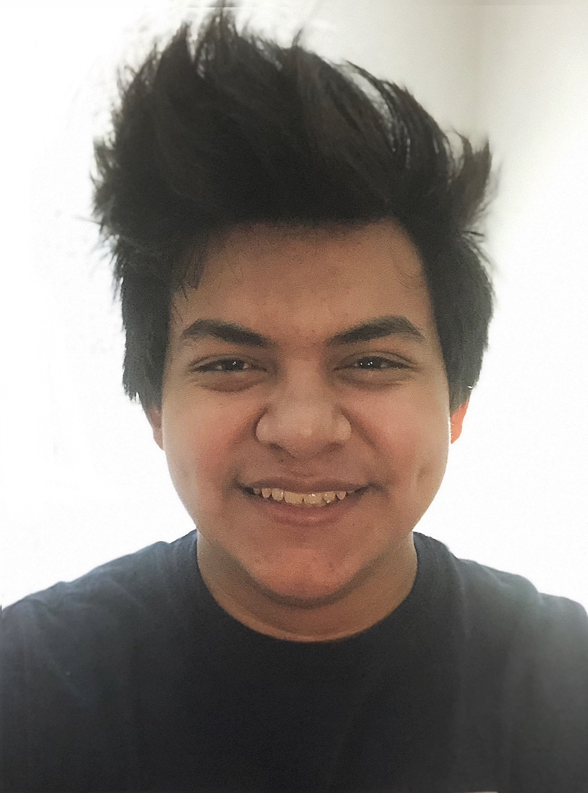
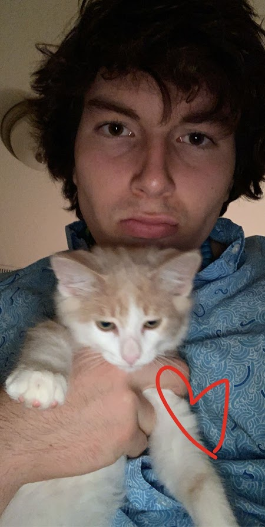
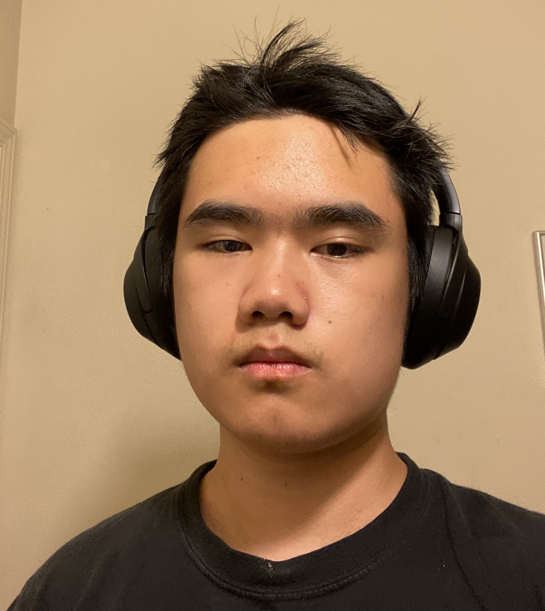

# About
Hi, my name is Miguel 20 years old and I’m a 3rd year mechanical engineer with a CS minor. With this project I aim to learn more about programming and other art related topics. I’ve created video games in the past and have been an officer of the Video Game Development Club and am used to working in a team. I overall want to contribute to a project that gives people a new perspective on what digital art can be. I hope to learn a lot!

Hi, my name is Steve Linder. I am a first year CS student at OSU. I enjoy weightlifting, sports, and video games. I'm 22 years old, and I am in the water polo club and Sigma Nu Delta Tau chapter. The themes I'd like to explore with our art piece include how digital art can emulate physical reality and be used in conjunction for a unique experience, or show how digital media changes perceptions and interactions with the physical world. I hope to gain more knowledge and appreciation of art throughout this term and to nurture skills in art. Thank you!

Hello everybody, my name is Dmitry Froemke, and I am a sophomore at Oregon State University Studying Business and Chemistry. I grew up in Portland, Oregon finding interests in basketball, skiing, and golf.  With Digital art I remember visiting my dad's work at intel where his co-workers were modeling a tree, this sparked my interest into the computer world. With this project I hope to expand all my skills and end with a memorable piece of art.

I’m Alvin Zhen, 19, and majoring in environmental engineering in Oregon state. I have prior knowledge and experience with Blender. I enjoy coming up with ideas and deconstructing them into theoretical components to imagine how each part works in the device, however they’re mostly fictional. I have partaken in the Oregon game project challenge 2021-2022 (OGPC) during my time in CTEC (career technical education center). I hope to further improve my experience with 3D modeling as well ad learn more about coding, as well as game and animation design.
